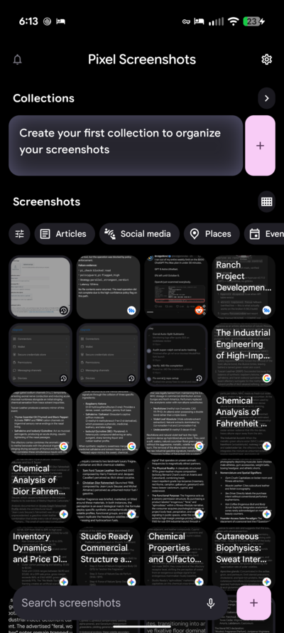

[](https://github.com/toxicwind/pearlctl/actions/workflows/ci.yml)
[](LICENSE)
[](https://bun.sh)
[](https://github.com/toxicwind/pearlctl/stargazers)

<h3 align="center">pearlctl</h3>
<p align="center">Drive Pixel Screenshots from the command line — the full decoded intent catalog of <code>com.google.android.apps.pixel.agent</code>, deep links, and a fast Bun CLI over ADB.</p>

<p align="center">
  <a href="docs/">Explore the docs »</a> ·
  <a href="docs/INTENT-CATALOG.md">Intent catalog</a> ·
  <a href="https://github.com/toxicwind/pearlctl/issues/new?labels=bug&template=bug_report.md">Report Bug</a> ·
  <a href="https://github.com/toxicwind/pearlctl/issues/new?labels=enhancement&template=feature_request.md">Request Feature</a>
</p>



<details><summary>Table of Contents</summary>
<ol>
  <li><a href="#about-the-project">About The Project</a></li>
  <li><a href="#getting-started">Getting Started</a></li>
  <li><a href="#usage">Usage</a></li>
  <li><a href="#whats-inside">What's Inside</a></li>
  <li><a href="#benchmarks">Benchmarks</a></li>
  <li><a href="#roadmap">Roadmap</a></li>
  <li><a href="#contributing">Contributing</a></li>
  <li><a href="#license">License</a></li>
  <li><a href="#acknowledgments">Acknowledgments</a></li>
</ol>
</details>

## About The Project

Google's **Pixel Screenshots** app runs an on-device AI agent — codenamed
**Pearl** (`com.google.android.apps.pixel.agent`) — that organizes and
searches your screenshots locally. The app is driven almost entirely by
Android intents: a share-sheet entry point that feeds images to the agent,
deep links (`pearl://browser/…`, `pixelagent://…/settings`), and internal
actions like `EXECUTE_TOOL` and `ADD_REMINDER`.

**pearlctl** is the decoded map of that control surface plus the tool to
drive it: every exported component, intent filter, deep link, and custom
action, recovered from the shipped APK and verified live on a Pixel 9 Pro XL
— wrapped in a one-command Bun CLI that talks to your phone over ADB.

### Built With

- [Bun](https://bun.sh) — runtime, test runner, bundler
- Android `adb` / `am` — the entire transport is stock intents, no root, no SDK

## Getting Started

### Prerequisites

- Bun ≥ 1.2 — `bun --version`
- `adb` on PATH — [platform-tools](https://developer.android.com/tools/releases/platform-tools)
- A Pixel with the Pixel Screenshots app, USB/wireless debugging enabled

### Installation

```sh
git clone https://github.com/toxicwind/pearlctl.git
cd pearlctl
bun install
```

That's it — no build step. First success in under 30 seconds:

```sh
export PEARLCTL_DEVICE=<your-phone-serial>
bun src/cli.ts launch        # Pixel Screenshots opens on your phone
```

## Usage

```sh
pearlctl launch
# → the app comes to the foreground

pearlctl deeplink pearl://browser/collections
pearlctl settings
# → in-app browser / settings via deep links

pearlctl analyze shot1.png shot2.png
# → pushes the images to the phone and SENDs each into the
#   on-device agent — the same path as the system share sheet.
#   Verified live: OverlayActivity comes to the foreground.

pearlctl inventory
# → exported components + intent filters, live from your phone via dumpsys

pearlctl bench
# → real intent round-trip timings (see docs/BENCHMARKS.md)
```

Full command reference: `pearlctl --help`. Deep-dive docs in [`docs/`](docs/):
the [intent catalog](docs/INTENT-CATALOG.md), [deep links](docs/DEEP-LINKS.md),
[verification methodology](docs/VERIFICATION.md), and [architecture](docs/ARCHITECTURE.md).

## What's Inside

| Path | What |
|---|---|
| `src/cli.ts` | The `pearlctl` CLI |
| `src/intents.ts` | Intent builders — single source of truth for every action, component, and URI in the catalog |
| `src/deeplink.ts` | `pearl://` / `pixelagent://` URI model + parser |
| `src/inventory.ts` | `dumpsys package` → structured component inventory |
| `src/adb.ts` | adb transport: discovery, shell, push, `am` |
| `scripts/benchmark.ts` | Live benchmark suite (real phone, real timings) |
| `tests/` | 13 unit tests — `bun test`, no phone needed |

## Benchmarks

Measured on a Pixel 9 Pro XL over adb-over-Wi-Fi (`pearlctl bench`,
median of 3–5 runs). Full table: [docs/BENCHMARKS.md](docs/BENCHMARKS.md).

## Roadmap

- [x] Full exported-component inventory (APK + live `dumpsys`)
- [x] Deep-link catalog (`pearl://`, `pixelagent://`)
- [x] Bun CLI: launch, deeplink, settings, analyze, inventory, services, remind
- [x] Live benchmark suite with real numbers
- [ ] `pearlctl query <text>` — drive on-device search end-to-end
- [ ] `pearlctl watch` — stream new-screenshot events as they land
- [ ] Catalog diff across app versions (`bun inventory` already regenerates it)
- [ ] Homebrew / npm distribution of the single-file binary

Have ideas? [Open an issue](https://github.com/toxicwind/pearlctl/issues/new?labels=enhancement&template=feature_request.md).

## Contributing

One paragraph: issues and PRs are welcome — read [CONTRIBUTING.md](CONTRIBUTING.md)
first. The fastest contribution is a `bun run inventory` dump from an app
version we haven't catalogued yet.

## License

Distributed under the MIT License. See [LICENSE](LICENSE) for more information.

## Acknowledgments

- Decoded with [apktool](https://ibotpeaches.github.io/Apktool/) and
  [jadx](https://github.com/skylot/jadx)
- README structure borrowed from [othneildrew/Best-README-Template](https://github.com/othneildrew/Best-README-Template)
- Not affiliated with Google. `Pixel Screenshots` is a trademark of Google LLC;
  this is an independent reverse-engineering reference.

---

Don't forget to give the project a star! Thanks again! ⭐
